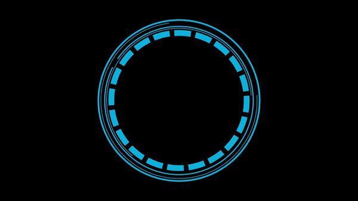

# :notes: AudioVisualizer

**:notes: AudioVisualizer** is an interactive software project that transforms audio input into captivating visualizations. It provides a visually engaging representation of sound, creating a dynamic experience for users. :sparkles:

## Features

:sound: Real-time audio processing and analysis
:art: Visual representation of audio through rotating circles
:speaker: Circle size and movement based on the volume and intensity of sound
:fast_forward: Smooth transition and responsiveness to changes in audio input




### Supported Platforms
- Linux (Tested ✔️)
- Windows (Not Tested ❌)
- MacOS (Not Tested ❌)

## Dependencies

To run this project, you need to have the following dependencies installed:

- 🐍 [Python](https://www.python.org/downloads/): Python is a programming language used by this project.
- 📦 [pip](https://pip.pypa.io/en/stable/): pip is the package installer for Python.
- ✨ [Kivy](https://kivy.org/): Kivy is an open-source Python library for developing multi-touch applications.
- 🔊 [Sounddevice](https://python-sounddevice.readthedocs.io/): Sounddevice is a Python library for audio input and output.
- 🔢 [NumPy](https://numpy.org/): NumPy is a fundamental package for scientific computing with Python, providing support for large, multi-dimensional arrays and matrices.


## Installation


##### Debian-based (e.g., Ubuntu, Debian):
```bash
# Update package lists
sudo apt update

# Install Python and pip
sudo apt install python3 python3-pip

# Install Kivy dependencies
sudo apt install libsdl2-dev libsdl2-image-dev libsdl2-mixer-dev libsdl2-ttf-dev libportmidi-dev libswscale-dev libavformat-dev libavcodec-dev zlib1g-dev

# Install Sounddevice dependencies
sudo apt install portaudio19-dev

# Install NumPy
pip3 install numpy
```
 
##### RPM-based (e.g., Fedora, CentOS, Red Hat Enterprise Linux):
```bash
# Install Python and pip
sudo dnf install python3 python3-pip

# Install Kivy dependencies
sudo dnf install gcc-c++ python3-devel libsdl2-devel libsdl2_image-devel libsdl2_mixer-devel libsdl2_ttf-devel portmidi-devel ffmpeg-devel

# Install Sounddevice dependencies
sudo dnf install portaudio-devel

# Install NumPy
pip3 install numpy
```

##### Windows
1. Install Python: Download and run the installer from python.org (https://www.python.org/downloads/)

2. Install pip: Ensure that pip is installed by default with Python nstallation

3. Install Kivy dependencies: Follow the instructions on Kivy's website for Windows (https://kivy.org/doc/stable/installation/installation-windows.html)

4. Install Sounddevice dependencies: Follow the instructions on Sounddevice's website for Windows (https://python-sounddevice.readthedocs.io/en/latest/installation.html#windows)

5. Install NumPy
pip install numpy

## Usage

Run the main application:
```shell
python main.py  # For Windows
```
or
```shell
python3 main.py # For Linux
```
The AudioVisualizer interface will open, displaying a dynamic rotating circle that reacts to audio input 🎵.
Enjoy the immersive experience as the circle's size and movement change in response to the volume and intensity of the audio 🔊.


## Customization

Adjust the speed of rotation by modifying the **angle** variable in the *RotatingButton* class.
```shell
 def __init__(self, **kwargs):
        super(RotatingButton, self).__init__(**kwargs)
        self.angle = 2  # By regulating angle, you can indirectly control the speed of rotation
```
Control the size limits of the circle by modifying the **min_size** and **max_size** variables in the *CircleWidget* class.
```shell
# Define relative minimal and maximal sizes for your circle
        self.min_size = .2 * SCREEN_WIDTH
        self.max_size = .7 * SCREEN_WIDTH
```

Customize the appearance of the circle by replacing the **circle.png** image file.
```shell
       # Create a rotating button representing the circle
        self.circle = RotatingButton(
            size=(self.min_size, self.min_size), 
            background_normal='circle.png')


```

## Code Description:
The code for the AudioVisualizer project utilizes Python 🐍 and the Kivy framework 🎨 to create a visually stunning application. It makes use of the numpy library 🔢 for numerical computations and the sounddevice library 🔊 for capturing and processing audio input. The project consists of several classes and functions, including a custom RotatingButton class 🔄 that enables the rotation of buttons, a CircleWidget class 🟡 that represents the main visual element, and the MyKivyApp class 📱 that builds and runs the Kivy application. The code handles audio streaming 🎧, volume analysis 🔊, and the dynamic adjustment of the circle's size and position based on the audio input. With its modular structure and clear function descriptions, the code provides a solid foundation for extending and customizing the AudioVisualizer project.

## Contributing
🙌 Contributions to AudioVisualizer are welcome! If you have any ideas, improvements, or bug fixes, please submit a pull request 🛠️. For major changes, please open an issue to discuss your ideas beforehand 💡.

## License

This project is licensed under the MIT License 📜.
## Acknowledgments

The project was inspired by the concept of audio visualization and interactive graphics.
Special thanks to the contributors of the numpy, sounddevice, and kivy libraries for their valuable tools and resources.
